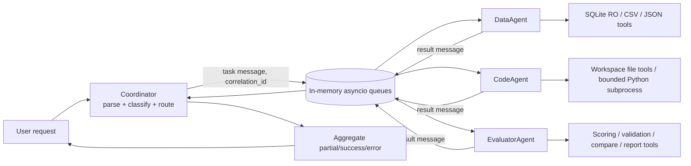

# Báo cáo Lab: Multi-Agent Orchestration, Tools & Evaluation

## 1. Tổng quan bài lab

Bài lab triển khai một hệ thống multi-agent nhỏ để nhận yêu cầu, phân loại ý định, chuyển task tới worker chuyên môn và tổng hợp phản hồi. Hệ thống hiện gồm coordinator, Data/Code/Evaluator workers, message queue bất đồng bộ và các tool local cho SQLite, CSV/JSON, file/code và đánh giá.

**Sinh viên:** Nguyễn Hồng Phi
**Mã sinh viên:** 2A202602750

**Phạm vi báo cáo:** báo cáo gồm harness/lab Deep Agents ban đầu và phần mở rộng worker/coordinator/tools. Không ghi khóa API. Provider/model settings chi tiết và nhiệt độ không được lưu trong artifact; không suy đoán.

## 2. Kiến trúc thiết kế và luồng thông điệp



Coordinator nhận string hoặc structured request; phân loại theo từ khóa thành `data_analysis`, `code_generation`, `evaluation` hoặc `complex`. Request phức hợp được chuyển song song tới DataAgent và CodeAgent. Mỗi message mang sender/recipient, timestamp, ID và correlation ID. Worker trả `success` hoặc `error`; coordinator ghép kết quả theo correlation ID và trả summary. Queue chỉ tồn tại trong bộ nhớ của process.

**Communication payload rút gọn:**

```json
{
  "type": "task",
  "from": "coordinator",
  "to": "data_agent",
  "task_id": "<id>",
  "correlation_id": "<unique-id>",
  "content": "Analyze Q3 sales",
  "parameters": {}
}
```

## 3. Chi tiết triển khai và quyết định thiết kế

- **Async orchestration:** dùng `asyncio` để chờ nhiều worker cùng lúc; tool/script I/O vẫn chạy cục bộ. Trade-off: quản lý cancellation và correlation phức tạp hơn gọi tuần tự.
- **In-memory queue:** dùng `asyncio.Queue` thay broker ngoài; đơn giản, không thêm dependency và phù hợp lab offline. Queue không durable/distributed.
- **Routing:** heuristic từ khóa để không phải gọi model chỉ nhằm phân loại. Nhanh và không tốn token, nhưng có thể phân loại sai câu mơ hồ.
- **SQLite:** mở DB trong workspace ở chế độ read-only; chỉ chấp nhận một câu `SELECT`/`WITH`, giới hạn số dòng/kích thước kết quả.
- **Code execution:** script chạy trong subprocess với timeout, output giới hạn và workspace làm working directory. Đây **không phải sandbox bảo mật OS**; chỉ chạy code đáng tin cậy.
- **Evaluator:** scoring có trọng số (accuracy 30%, completeness 30%, clarity 20%, performance 20%), cộng validation/compare/report formatting. Các công cụ kiểm tra cấu trúc, không tự chứng minh tính đúng của nội dung.
- **Bonus cache:** `CachingCoordinator` dùng SHA-256 của JSON chuẩn hóa, LRU giới hạn dung lượng, chỉ cache kết quả thành công; trả deep copy. Trade-off: dữ liệu có thể cũ nếu nguồn thay đổi; cache hiện chỉ trong memory/process.

## 4. Kết quả kiểm thử

Sau khi thêm bonus cache, lượt pytest cuối đạt **53 passed**; test chậm nhất là `test_untouched_workspace_does_not_score_full` với **6.90 s**. Suite bao gồm unit test agent/runner/curator/coordinator/workers/tools, integration coordinator→DataAgent→SQLite tool, concurrent requests và cache hit/miss/error/isolation/LRU. Standalone worker-tool integration đạt **3/3**, coordinator smoke đạt **3/3**.

Một lần E2E với model thật đã chạy: DataAgent gọi `query_database` một lần trên SQLite fixture và trả Q3 revenue **5,000,000** trong **2.627 giây**. Kết quả thành công, nhưng lần chạy đầu báo lỗi Windows khi dọn fixture do file lock; fixture đã được xác nhận và dọn thủ công. Không chạy lại model thật sau chỉnh cleanup. Token usage không có trong record đáng tin cậy.

| Case | Kỳ vọng | Bằng chứng hiện có |
|---|---|---|
| SQLite read-only query | SELECT được, mutation/multi-statement bị chặn | `tests/test_04_tools.py` |
| Worker tool failure | Lỗi tool trả về có cấu trúc | `tests/test_05_workers.py` |
| Concurrent routing | Không tráo kết quả giữa hai request | `tests/test_06_integration.py` |
| Cache success/error/LRU | Thành công được cache; lỗi không cache; dung lượng giới hạn | `tests/test_07_cache.py` (mới thêm, chờ chạy) |

Không đo code coverage. Không có test/benchmark cho queue saturation hoặc persistent recovery; không tuyên bố các trường hợp đó đã được kiểm chứng.

## 5. Phân tích hiệu suất

### Benchmark offline

20 request qua coordinator với hai fake worker song song, không gọi model/API. Số liệu trong `report/benchmark_offline.json`:

| Metric | Kết quả |
|---|---:|
| Min | 0.0030 s |
| Max | 0.0100 s |
| Mean | 0.0067 s |
| Median | 0.0069 s |
| P50 (ước lượng nearest-rank) | 0.0069 s |
| P99 (ước lượng nearest-rank) | 0.0100 s |
| Throughput đo trong workload fake | 8,893.8 req/min |
| Error rate | 0% |

Các giá trị này đo orchestration local/fake worker, không đại diện throughput sản xuất hay latency provider. Mẫu 20 request cũng không đủ để khẳng định P99 thực.

### Một lần đo model thật

Một request E2E đạt 5,000,000 trong **2.627 s**. Một mẫu đơn lẻ không cho phép tính P50/P99, error rate hoặc token cost đáng tin cậy.

### Profile và bottleneck

`report/profile_offline.prof` được tạo từ 100 workflow offline. Lần profile cuối ghi tổng **0.219 s**; các chi phí cumulative nổi bật là event loop asyncio, `Coordinator.process_request` (400 calls, 0.110 s) và `MessageQueue.send_message` (400 calls, 0.093 s); `deepcopy` chiếm 0.066 s cumulative. Đây là profile workload giả lập nhỏ; deep-copy/logging là cơ hội tối ưu cục bộ, nhưng chưa phải bằng chứng bottleneck của model thật.

Không đo memory/CPU ngoài thời gian cProfile. Không có cơ sở báo throughput provider, resource usage production hoặc tiết kiệm latency sau caching.

## 6. Phân tích lỗi và resilience

- **Input không hợp lệ / task type không hỗ trợ:** parser/routing ném `ValueError` rõ ràng.
- **Worker exception:** vòng worker chuyển exception thành result `status=error`; các task khác vẫn có thể trả kết quả.
- **Timeout:** coordinator trả `status=timeout` nếu không nhận phản hồi trước deadline. Đây không phải retry; thao tác đã chạy trong worker không được đảm bảo dừng ngay.
- **Tool error:** BaseWorker ghi log và trả error có cấu trúc.
- **SQLite write hoặc multi-statement:** chế độ read-only và validation từ chối; tests kiểm tra các trường hợp này.
- **Windows cleanup:** lần E2E thật gặp file lock khi xóa DB tạm; file đã được dọn sau khi xác định. Script được cập nhật để giải phóng tham chiếu, nhưng chưa chạy lại E2E thật.
- **Không triển khai:** exponential retry, circuit breaker, fallback worker, persistent queue hoặc queue-full policy. Vì vậy không gán resilience score số học.

## 7. So sánh thiết kế dự kiến với hiện thực

| Khía cạnh | Mục tiêu ban đầu | Hiện thực / bằng chứng | Chênh lệch |
|---|---|---|---|
| Định tuyến | Chọn worker theo loại việc | Keyword heuristic; complex gửi tới data + code | Chưa có model-based planning |
| Giao tiếp | Queue async và correlate response | In-memory asyncio queue, ID/correlation ID | Không persistent/distributed |
| Tool safety | DB/code/file/evaluator tools | SQLite read-only, workspace path validation, timeout; script vẫn không phải sandbox | Không tuyên bố chạy code không tin cậy an toàn |
| Test | Unit + integration + E2E | 50 tests pass ở lần trước bonus; 1 real E2E; bonus tests mới chưa chạy | Cần chạy full suite sau bonus |
| Performance | Đo latency/throughput | Fake benchmark và profile offline; một real sample | Không thể so trực tiếp hay suy rộng production |
| Freeze/đánh giá lab gốc | Hypotheses trước freeze và đủ eval conditions | Chưa có tag freeze; chỉ có 3 baseline learn và 2 subagents learn artifacts | Quy trình đánh giá đầy đủ chưa hoàn tất |

**Các kết quả học hiện có:** baseline `code-learn` 7/10 (37,501 tokens, 18.4 s), `data-learn` 5/8 (120,232 tokens, 42.5 s), `logs-learn` 9/9 (212,233 tokens, 35.6 s). Subagents: `code-learn` 6/10 (344,238 tokens, 161.4 s, một subagent call), `data-learn` 5/8 (397,365 tokens, 111.8 s, một subagent call). Đây là số liệu mô tả các run learn hiện có, không phải so sánh đầy đủ giữa conditions; thiếu subagents logs-learn và toàn bộ eval runs. Không kết luận điều kiện nào tốt hơn từ bộ dữ liệu thiếu này.

## 8. Khả năng mở rộng

- **Nhiều request/worker:** có thể chạy nhiều worker coroutine, nhưng queue/coordinator hiện ở một process và không có backpressure/persistence; process crash làm mất message.
- **Nhiều máy:** cần broker durable (ví dụ Redis/RabbitMQ), schema/versioning, auth và idempotency trước khi phân tán.
- **Task lớn:** SQLite output bị giới hạn dòng/kích thước; cần pagination/streaming nếu xử lý dataset lớn.
- **Model throughput:** chưa benchmark nhiều request với provider; không có số liệu để dự báo req/min thật.
- **Cache bonus:** giảm công việc lặp trong một process, nhưng phải thêm expiry/invalidation nếu nguồn dữ liệu thay đổi; không dùng cache thành công như bảo đảm dữ liệu luôn mới.

Không gán scalability score vì chưa có load test đa process/máy.

## 9. Hạn chế và cân nhắc

1. Chỉ có một E2E model thật, không đủ thống kê latency/token/error.
2. Benchmark offline dùng fake workers, workload nhỏ; không đại diện mạng, provider hoặc concurrency thực tế.
3. Bộ artifacts lab gốc thiếu subagents logs-learn, các kết quả eval, hypothesis commit và tag `freeze`; do đó chưa đáp ứng đầy đủ thiết kế học/eval chống leakage của GUIDE.
4. Không đo code coverage hoặc memory/CPU.
5. Keyword routing có thể nhầm ý định; queue in-memory không durable.
6. Subprocess Python có timeout nhưng không cách ly filesystem/network/OS.
7. Cache có thể trả kết quả cũ nếu dữ liệu nền thay đổi; hiện không có TTL/invalidation.
8. Lần cleanup fixture trên Windows đã lỗi ở E2E đầu; script có thay đổi nhưng chưa xác nhận bằng lần gọi model thứ hai.

## 10. Kết luận và đề xuất tiếp theo

Hệ thống worker/coordinator/tools hoạt động được trong các test local đã chạy và một E2E thật; E2E truy vấn SQLite trả đúng giá trị fixture. Benchmark offline xác nhận overhead orchestration nhỏ trong workload giả lập, nhưng không cho phép suy rộng hiệu suất model/API. Trước khi kết luận về chất lượng multi-agent trong lab gốc, cần hoàn tất các learn/eval runs hợp lệ, hypothesis commit và freeze theo GUIDE. Bước tiếp theo ưu tiên là chạy full pytest sau bonus, hoàn tất thí nghiệm còn thiếu theo quy trình, rồi cân nhắc persistent queue và sandbox OS thực sự.

## Phụ lục: Bonus 6c — In-memory result caching

Đã thêm `CachingCoordinator`: canonical JSON request → SHA-256 key, LRU có giới hạn, chỉ cache aggregate có `status=success`; hit trả deep copy kèm `cache_hit=true`. Error/partial/timeout không được lưu. Test bao phủ hit/miss, request khác nhau, lỗi không cache, mutation isolation và eviction; cả 53 pytest đều pass. Benchmark cold/warm một request fake-worker: cold **0.00687 s**, warm cache-hit **0.000107 s**, worker calls tổng **41** (20 requests × 2 workers + cold request × 1 worker; warm hit không gọi worker). Đây chỉ là một phép đo minh họa đơn lẻ, không phải bằng chứng tăng tốc ổn định hoặc production.

## Phụ lục tái lập

- Offline tests: `.venv/Scripts/python.exe -m pytest -q --durations=10`
- Tool smoke: `.venv/Scripts/python.exe scripts/test_tool_integration.py`
- Coordinator smoke: `.venv/Scripts/python.exe scripts/test_coordinator_standalone.py`
- Offline benchmark: `.venv/Scripts/python.exe scripts/benchmark.py --iterations 20`
- Offline profile: `.venv/Scripts/python.exe scripts/profile_system.py --iterations 100`
- Real E2E (gọi provider, không tự retry): `.venv/Scripts/python.exe scripts/real_e2e.py`
- Commit/tag freeze: **chưa có**.
